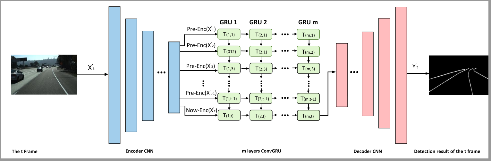
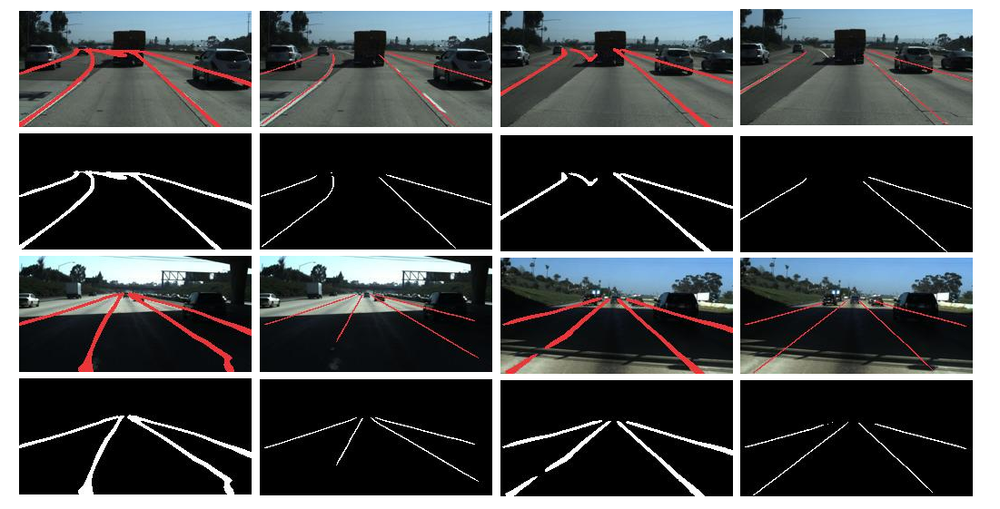
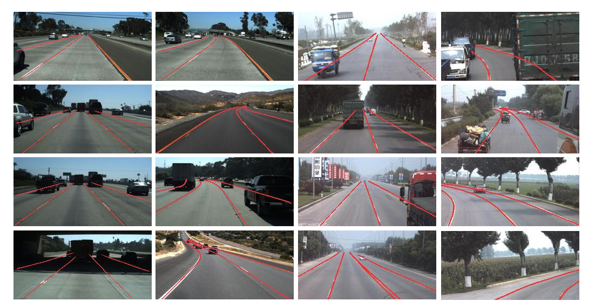
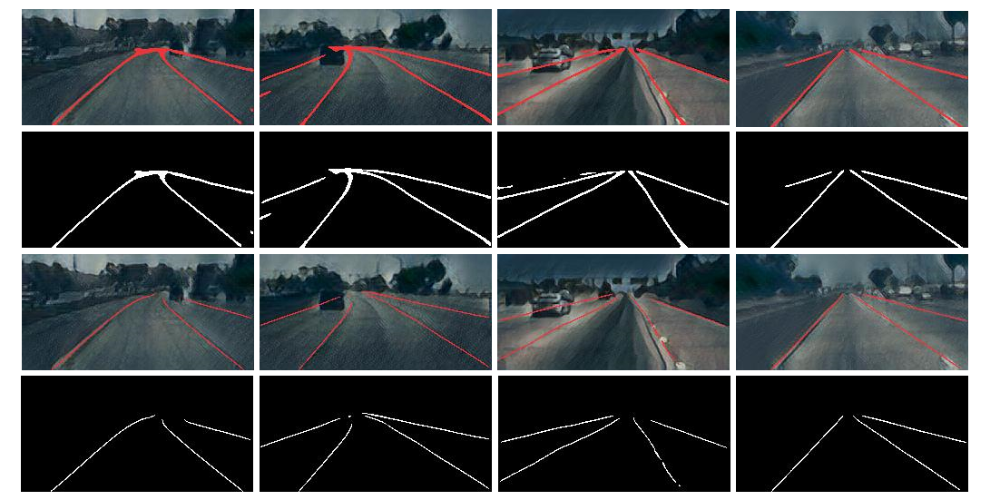

# ConvGRULane

PyTorch implementation of the paper "[Enhancing Robustness of Lane Detection through Dynamic Smoothness]".


## Introduction


When the lane of the current frame needs to be
detected, it is only necessary to extract the feature map of the current frame through the Encoder network
in the present moment. Then, it is used together with the features of the previously t−1 frames historically
saved through the Encoder network as the input of ConvGRU model for feature fusion. The Encoder-Decoder
network branch is applied to extract feature map, and the ConvGRU branch is used to learn the semantic
relationship of t historical frames and fuse the feature information of these frames.

## Get started
1. Clone the ConvGRULane repository
    ```
    git clone https://github.com/Cuibaby/ConvGRULane.git
    ```

2. Create a conda virtual environment and activate it (conda is optional)

    ```Shell
    conda create -n lane python=3.8 -y
    conda activate lane
    ```

3. Install dependencies

    ```Shell
    # Install pytorch firstly, the cudatoolkit version should be same in your system. (you can also use pip to install pytorch and torchvision)
    conda install pytorch torchvision cudatoolkit=10.1 -c pytorch

    # Or you can install via pip
    pip install torch torchvision

4. Data preparation

    Download [Tusimple](https://github.com/TuSimple/tusimple-benchmark/issues/3) and our [style lane dataset](https://drive.google.com/drive/folders/1cKwcCPHVDeOyN1Zbt57qzWkQ6yZUPIgo). Then extract them to  `$DATASET`. Create link to `data` directory.
    
    ```Shell
    cd $ConvGRULane_ROOT
    mkdir -p data
    ln -s $DATASET data/
    ```
## Training

For training, run

```Shell
python train.py 
```

## Testing
For testing, run
```Shell
python test.py 
```
We provide two trained models on Tusimple and our style lane dataset, you can download our trained model. (Tusimple: [GoogleDrive](https://drive.google.com/drive/folders/1FNKCscZusiRSFvXlCFTEZOp9YnlQbrXM),
style lane: [GoogleDrive](https://drive.google.com/drive/folders/1FNKCscZusiRSFvXlCFTEZOp9YnlQbrXM)
). More details can be seen in our paper.

## Compare

The first and third columns are visualization results based on single
frame detection method (UNet), and the second and fourth columns are visualization results of our method.
The second and fourth rows are the output grayscale images.


The two columns on the left are
the visualization results of Tusimple dataset, and other columns are the visualization results of Rural Road
dataset.


The top two rows are based on the method of Unet_ConvLSTM, and the
last two rows are applied our method. The second and fourth rows are the output grayscale images.


## Citation
Please cite our paper if you use this code or data in your own work:

```BibTeX
```
